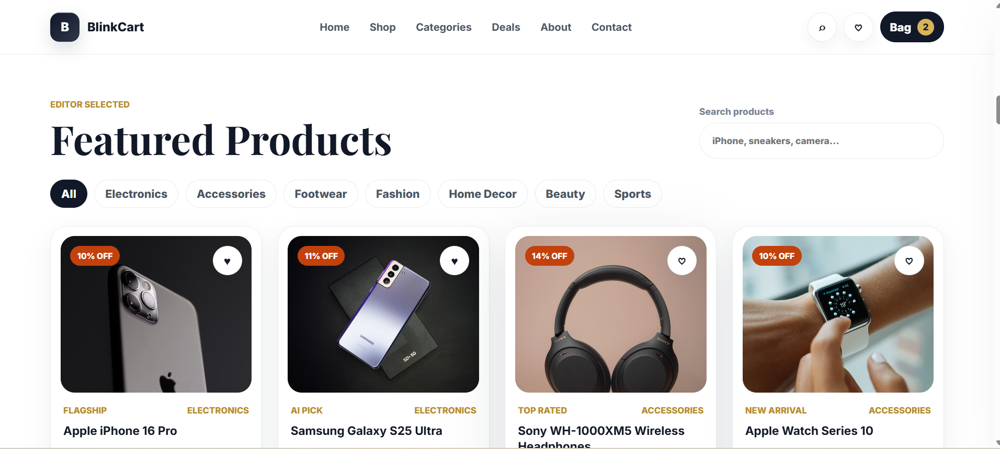
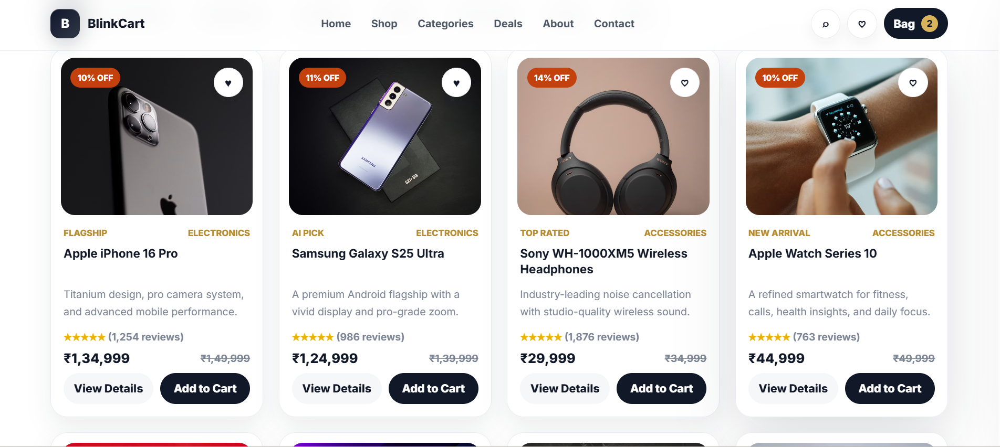
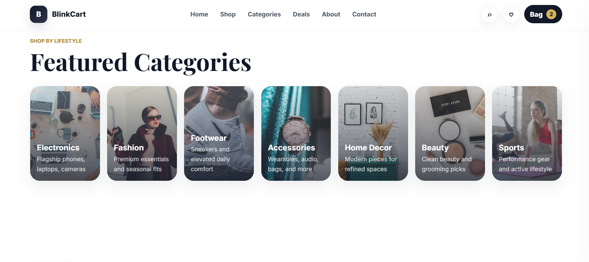
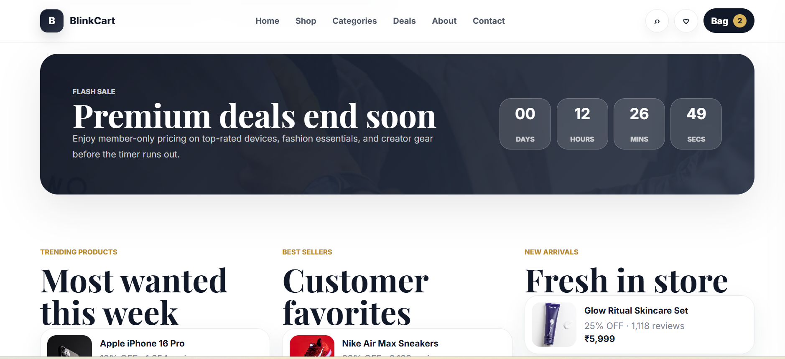
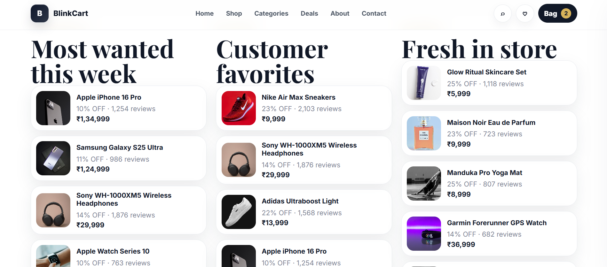
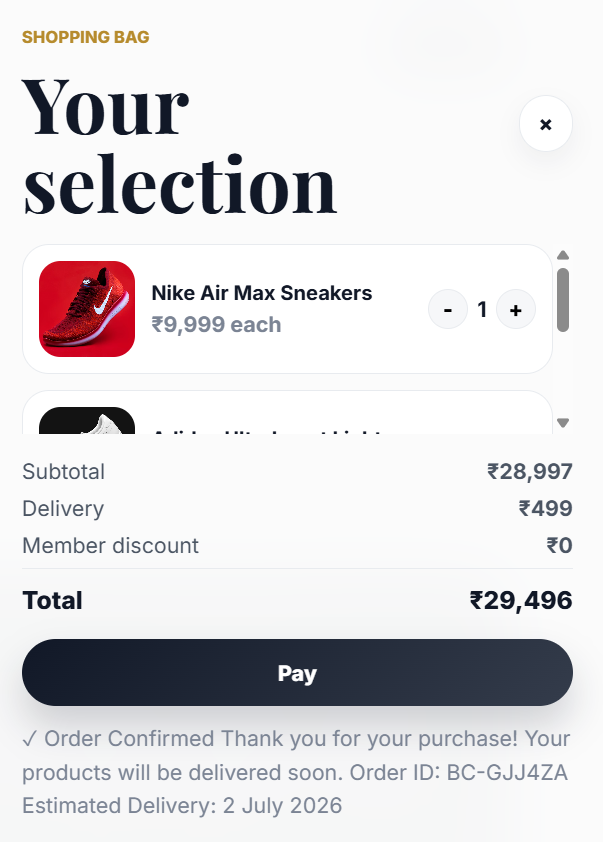
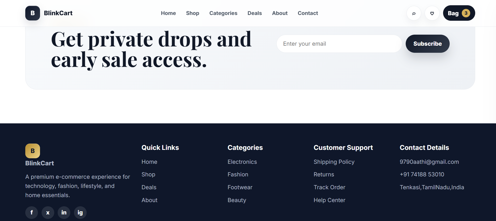

# 🛒 BlinkCart – Full Stack E-Commerce Web Application

## 📌 Overview

BlinkCart is a modern full-stack e-commerce web application developed as part of my **CodeAlpha Full Stack Development Internship**.

The application provides a seamless online shopping experience with product browsing, user authentication, shopping cart, wishlist, and order processing. It demonstrates full-stack web development using Node.js, HTML, CSS, JavaScript, and JSON-based data storage.

---

# 🎯 Project Objective

The objective of BlinkCart is to simulate a real-world online shopping platform where users can:

- Browse products
- Create an account
- Login securely
- Add products to cart
- Manage wishlist
- Place orders

This project helped me understand frontend development, backend API creation, user authentication, data management, and responsive web design.

---

# ✨ Features

- 🔐 User Registration & Login
- 🛍️ Product Catalog
- 📄 Product Details
- 🔍 Product Search
- ❤️ Wishlist Management
- 🛒 Shopping Cart
- 📦 Order Processing
- 📱 Responsive Design
- ⚡ Fast & Interactive User Interface

---

# 🛠️ Tech Stack

## Frontend

- HTML5
- CSS3
- JavaScript (ES6)

## Backend

- Node.js
- Native HTTP Module

## Database

- JSON Files
  - products.json
  - users.json
  - orders.json

---

# 📂 Project Structure

```
BlinkCart/

├── data/
│   ├── orders.json
│   ├── products.json
│   └── users.json
│
├── public/
│   ├── app.js
│   ├── index.html
│   └── styles.css
│
├── package.json
├── server.js
└── README.md
```

---

# 🚀 Getting Started

## Prerequisites

- Node.js
- npm

---

## Installation

### Clone the Repository

```bash
git clone https://github.com/Aathibarath/BlinkCart.git
```

### Navigate to the Project

```bash
cd BlinkCart
```

### Install Dependencies

```bash
npm install
```

### Start the Server

```bash
node server.js
```

or

```bash
npm start
```

### Open the Application

Open your browser and visit:

```
http://localhost:3000
```

---

# 📖 API Endpoints

| Method | Endpoint | Description |
|---------|----------|-------------|
| GET | /api/products | Get all products |
| GET | /api/products/:id | Get product details |
| POST | /api/register | Register new user |
| POST | /api/login | User login |
| POST | /api/orders | Place an order |

---

# 🎯 Internship Task

This project was developed as **Task 1 – Simple E-Commerce Store** for the **CodeAlpha Full Stack Development Internship**.

The project demonstrates:

- Full Stack Web Development
- REST-style API Development
- User Authentication
- Shopping Cart Functionality
- Order Processing
- Responsive User Interface
- Clean Project Structure

---

# 📈 Future Enhancements

- MongoDB Integration
- JWT Authentication
- Payment Gateway Integration
- Admin Dashboard
- Product Reviews & Ratings
- Order History
- Email Notifications
- Coupon & Discount System

---

# 📷 Screenshots

# 📷 Screenshots

| Home Page | Products |
|------------|----------|
|  |  |

| Product List | Categories |
|--------------|------------|
|  |  |

| Deals | Trending Products |
|--------|-------------------|
|  |  |

| Payment | Contact |
|----------|---------|
|  |  |

# 👨‍💻 Author

**Aathi Barath R**

🎓 B.Tech Computer Science Engineering

🔗 GitHub:
https://github.com/Aathibarath

---

⭐ If you found this project useful, consider giving it a Star!
